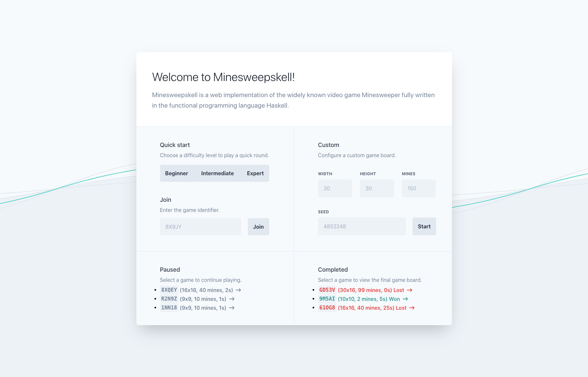
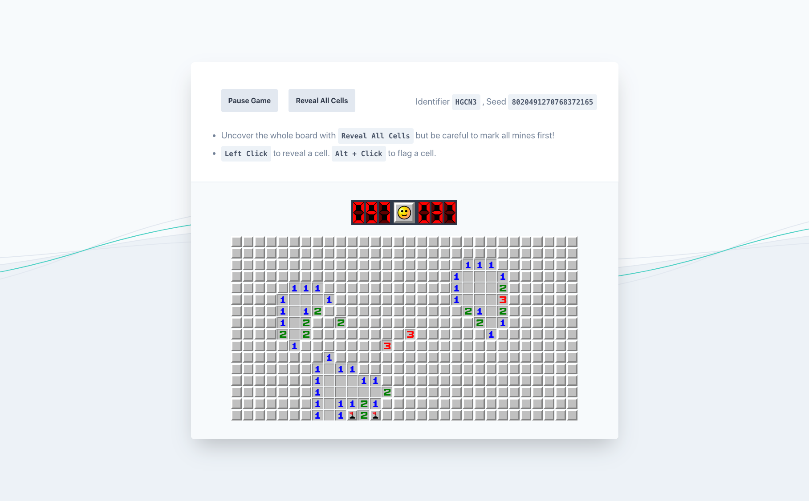

# ffp


Fortgeschrittene Funktionale Programmierung - Group project (2020)

- [ffp](#ffp)
  - [Description](#description)
  - [Features](#features)
  - [Architecture](#architecture)
      - [Web application with the `Yesod` framework](#web-application-with-the-yesod-framework)
      - [Global mutable in-memory state with `TVars `](#global-mutable-in-memory-state-with-tvars-)
      - [Database with `Persistent` & `MongoDB`](#database-with-persistent--mongodb)
      - [Elegant data accessing/manipulation with `Lenses`](#elegant-data-accessingmanipulation-with-lenses)
      - [Utilisation of `Monads`](#utilisation-of-monads)
  - [Installation](#installation)
    - [Requirements](#requirements)
      - [Install Haskell and Yesod](#install-haskell-and-yesod)
      - [Install MongoDB](#install-mongodb)
  - [Usage](#usage)
    - [Development](#development)
        - [ADJUST GHC PROMPT](#adjust-ghc-prompt)
    - [Tests](#tests)
  - [Dependencies](#dependencies)
  - [Contributors](#contributors)
    - [Individual contributions](#individual-contributions)

## Description

Minesweepskell is a web implementation of the widely known video game Minesweeper fully written in the functional programming language Haskell.

## Features

- Minesweeper Web App with three predefined difficulties as well as customisable games
- Slim & blazing fast UI powered by server side events
- Join other players on their game either to view them playing or to play together
- Pause games & continue later
- History of all finished games to revisit your best & worst performances

 

## Architecture

#### Web application with the `Yesod` framework

- REST Backend
- Frontend fully developped in `Yesods` shakespearean templating system
- Server-side events in order to provide live UI rerendering and updates for a flawless User Interface, which even has the possibility to play/view one game on multiple Bowsers/Machines simultaneously

#### Global mutable in-memory state with `TVars `

- Global state of all ongoing games realized with `TVars`, which provide mutability as well as atomic writing operations
- The state only contains all ongoing games, paused and finished (lost/won) games are moved from the in-memory state to the database, if a paused game is continued it will be loaded back into the in-memory state

#### Database with `Persistent` & `MongoDB`

- As just mentioned Minesweepskell stores non-ongoing games in a database this is realized by using the `Persistent` library to connect a `MongoDB`

#### Elegant data accessing/manipulation with `Lenses`

- In order to manipulate and query data types more elegantly `lenses` are used for almost all operations on data types
- Lenses for matrices are provided by the `matrix-lens` package and provide elegant manipulation of cells on the game board

#### Utilisation of `Monads`

- `Monads` are widely used throughout the project, especially the IO monad for things like state manipulation, as well as Yesods Handler Monad for the REST API, own Monads are not defined
- **Problem:** Initially we wanted to realize the global mutable state with the `State` monad, but we could not get it to work in combination with Yesods handler monad. Due to this we switched to TVars for the global in-memory state, which proved to be a better choice, since it even provides atomic writing operations and was astonishingly smooth to implement for our use cases.

## Installation

Run in the project folder `stack build`.

### Requirements

```bash
$ stack --version
Version 2.3.3 x86_64

$ yesod version
yesod-bin version: 1.6.0.6
```

#### Install Haskell and Yesod

1. Install [haskell-stack](http://haskellstack.org/) and [yesod](https://www.yesodweb.com/)

```bash
# - if it fails run `xcode-select --install before`
brew install haskell-stack
stack install yesod-bin --install-ghc
```

2. Add yesod installation path to your shell

```
# ~/.zshrc
export PATH=$HOME/.local/bin:$PATH
```

If you have trouble, refer to the [Yesod Quickstart guide](https://www.yesodweb.com/page/quickstart) for additional detail.

#### Install MongoDB

1. Install MongoDB

```sh
brew tap mongodb/brew
brew install mongodb-community@4.4
```

2. Run MongoDB

```sh
brew services start mongodb-community@4.4
brew services stop mongodb-community@4.4
```

3. Verify that it is running `ps aux | grep -v grep | grep mongod`, logs can be found here `/usr/local/var/log/mongodb/mongo.log.` and settings here `/usr/local/etc/mongod.conf`

For more information take a look at https://docs.mongodb.com/manual/tutorial/install-mongodb-on-os-x/

4. Use [MongoDB Compass](https://www.mongodb.com/products/compass) as GUI

## Usage

### Development

- Build libraries: `stack build`
- Start a development server with `stack exec -- yesod devel`, it watches for changes and recompiles the project automatically.
- Go to `http:localhost:3000` to see landing page
- Run `stack clean --full && stack build` to clean the project and to rebuild it.

##### ADJUST GHC PROMPT

- add the following to your `~/.ghc/ghci.conf`

```haskell
:set prompt      λ:
:set prompt-cont λ|
```

https://stackoverflow.com/a/47694134

### Tests

```
stack test --flag minesweepskell:library-only --flag minesweepskell:dev
```

(Because `yesod devel` passes the `library-only` and `dev` flags, matching those flags means you don't need to recompile between tests and development, and it disables optimization to speed up your test compile times).

## Dependencies (excerpt)

```
yesod
mongodb
persistent
lens
matrix-lens
...
```
For more details take a look at the [package.yaml](package.yaml).

## Code formatting
Along with the [IntelliJ plugin for Haskell](https://github.com/rikvdkleij/intellij-haskell) [Ormolu](https://github.com/tweag/ormolu) is used as automatic code formatter.

## Contributors

- Andreas Ellwanger
- Timo Erdelt
- Andreas Griesbeck

### Individual contributions

Due too the small group size of 3 it is impossible for us to properly distinguish what of our project has been done by whom. We all worked on all parts of our application, especially since we mostly did “pair-programming” (with two or often all three of us working together). So all of us were equally involved in all parts of our application.
We would be happy to answer questions about our development process, aswell as our individual/collective contributions at the examination.
